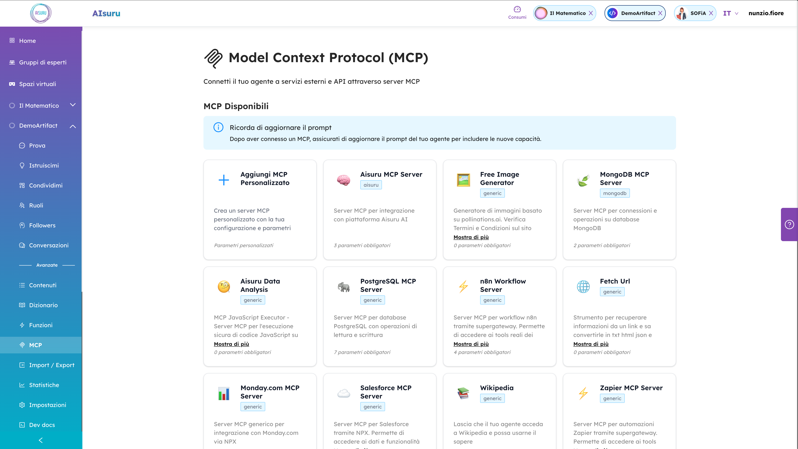

# MCP JavaScript Executor

Secure MCP server that executes JavaScript code for data analysis with support for multiple data formats using isolated-vm.

## 🚀 Features

- ✅ **Multi-format Data Support**: JSON, CSV, TSV, and pipe-separated data
- ✅ **Smart Format Detection**: Automatically detects data format from content (not file extension)
- ✅ **Secure Execution**: Isolated JavaScript environment with resource limits
- ✅ **Flexible Data Input**: Support for URLs and inline data
- ✅ **Advanced JavaScript**: Variables, functions, return statements, and complex logic
- ✅ **Safety Limits**: 5-second timeout and 128MB memory protection

## 📊 Supported Data Formats

### JSON
```json
[{"name": "John", "age": 30}, {"name": "Jane", "age": 25}]
```

### CSV (Comma-separated)
```csv
name,age,city
John,30,New York
Jane,25,Boston
```

### TSV (Tab-separated)
```tsv
name	age	city
John	30	New York
Jane	25	Boston
```

### Pipe-separated
```
name|age|city
John|30|New York
Jane|25|Boston
```

**Note**: The MCP automatically detects the format and delimiter from the content, converting all tabular data into JavaScript arrays of objects.

## Installation

### NPX (Recommended)
```bash
npx mcp-js-executor
```

### Local Installation
```bash
npm install -g mcp-js-executor
mcp-js-executor
```

## 🔧 Setup with AI Agents

### Claude Desktop
Add to your `claude_desktop_config.json` file:

```json
{
  "mcpServers": {
    "js-executor": {
      "command": "npx",
      "args": ["mcp-js-executor"]
    }
  }
}
```

**Config file locations:**
- **macOS**: `~/Library/Application Support/Claude/claude_desktop_config.json`
- **Windows**: `%APPDATA%\Claude\claude_desktop_config.json`

### Other MCP-Compatible Frameworks
This server works with any framework that supports the Model Context Protocol (MCP):

- **Cline**: Add to your MCP server configuration
- **Continue**: Configure in your MCP settings
- **Custom implementations**: Use standard MCP client libraries

### Local Development
```bash
git clone https://github.com/memori-ai/mcp-js-executor.git
cd mcp-js-executor
npm install
npm start
```

## 🔧 Usage Examples

### Quick Start with Claude
Once configured, you can ask Claude to analyze data:

```
"Analyze this CSV file: https://example.com/sales.csv
Count how many sales were made in August"
```

Claude will automatically use the JavaScript executor to:
1. Fetch and parse the CSV data
2. Execute JavaScript to filter August sales
3. Return the count and analysis

### Simple Data Analysis
```javascript
// Count total records
data.length

// Filter and count active items
data.filter(item => item.status === 'active').length

// Find maximum value
Math.max(...data.map(item => item.price))
```

### Complex Data Processing
```javascript
// Sales analysis by month
const salesByMonth = {};
data.forEach(sale => {
  const month = sale.Mese;
  salesByMonth[month] = (salesByMonth[month] || 0) + sale['Totale Vendita'];
});
return Object.entries(salesByMonth).map(([month, total]) => ({month, total}));
```

### Advanced Analytics
```javascript
// Find top performers with statistics
const sellers = {};
data.filter(o => o.Mese === 'agosto').forEach(o => {
  sellers[o.Venditore] = (sellers[o.Venditore] || 0) + 1;
});
return Object.entries(sellers)
  .map(([name, count]) => ({name, orders: count}))
  .sort((a,b) => b.orders - a.orders);
```

## 🌐 MCP Tool Call Format

### Using URL Data Source
```json
{
  "tool": "execute_js",
  "parameters": {
    "url": "https://example.com/data.csv",
    "code": "data.filter(item => item.status === 'active').length"
  }
}
```

### Using Inline Data
```json
{
  "tool": "execute_js", 
  "parameters": {
    "data": [{"name": "John", "age": 30}],
    "code": "data.filter(person => person.age > 25).length"
  }
}
```

## 🔄 Data Conversion Process

1. **Format Detection**: Analyzes content to identify delimiter (`,`, `\t`, `;`, `|`)
2. **Smart Parsing**: Skips header lines and separator rows automatically
3. **Type Conversion**: Converts strings to numbers/booleans when appropriate
4. **Object Creation**: Transforms rows into JavaScript objects with column headers as keys

### Example Conversion
**Input CSV:**
```
name,age,active
John,30,true
Jane,25,false
```

**Becomes JavaScript:**
```javascript
[
  {"name": "John", "age": 30, "active": true},
  {"name": "Jane", "age": 25, "active": false}
]
```

## 🛡️ Security & Limits

- **Isolated Execution**: Uses `isolated-vm` for complete sandboxing
- **Memory Limit**: 128MB maximum per execution
- **Timeout Protection**: 5-second execution limit
- **No File System Access**: Cannot read/write local files
- **No Network Access**: Cannot make external HTTP requests (except for data fetching)
- **Safe Environment**: No access to Node.js modules or system functions

## ❓ Troubleshooting

### Claude Desktop Not Detecting MCP
1. Ensure the config file is in the correct location
2. Restart Claude Desktop completely
3. Check that the JSON syntax is valid
4. Verify `npx` is available in your PATH

### Permission Errors
```bash
# Fix npm permissions (macOS/Linux)
sudo npm install -g mcp-js-executor

# Or use npx (recommended)
npx mcp-js-executor
```

### Connection Issues
- Ensure no firewall is blocking the MCP server
- Check that port 3000 (default) is available
- Try running the server manually first: `npx mcp-js-executor`

## 🔧 Technical Details

### Supported Delimiters
- `,` (comma) - Standard CSV
- `\t` (tab) - TSV files  
- `;` (semicolon) - European CSV format
- `|` (pipe) - Custom delimiter format

### Auto-Detection Logic
1. Analyzes first data line (skipping headers and separators)
2. Counts occurrence of each delimiter
3. Selects most frequent delimiter
4. Falls back to comma if no clear winner

### Data Type Conversion
- **Numbers**: Automatic conversion for integers and floats
- **Booleans**: Converts "true"/"false" strings
- **Null Values**: Empty cells become `null`
- **Strings**: Everything else remains as string

## 📈 Version History

### v1.1.0 (Current)
- ✅ Added CSV/TSV/pipe-separated data support
- ✅ Implemented smart delimiter detection
- ✅ Enhanced data parsing with type conversion
- ✅ Improved error handling for malformed data
- ✅ Maintained full backward compatibility

### v1.0.2
- ✅ Initial JSON-only support
- ✅ Basic JavaScript execution
- ✅ Security isolation with isolated-vm

## 🤝 Contributing

This MCP server is designed for secure data analysis. When contributing:

1. Maintain security isolation
2. Preserve backward compatibility
3. Add comprehensive tests for new data formats
4. Update documentation and examples

## 📄 License

MIT License - Feel free to use in your projects!

## 🚀 Try it on Aisuru.com

You can experiment with this MCP server directly on **[Aisuru.com](https://aisuru.com)** - our AI agent platform where you can create, test, and deploy intelligent agents with access to powerful tools like this JavaScript executor.



### 🎯 Perfect for:
- **Data Analysis**: Process CSV/TSV files with custom JavaScript logic
- **Agent Development**: Test JavaScript execution capabilities in your AI workflows  
- **Rapid Prototyping**: Experiment with different data processing approaches
- **Multi-format Support**: Work seamlessly with JSON, CSV, TSV, and pipe-separated data

Visit [Aisuru.com](https://aisuru.com) to start building with your agents today!

---

## ❤️ Made with Love

**mcp-js-executor** is crafted with love by the [**Memori.ai**](https://memori.ai) team - the creators of [**Aisuru.com**](https://aisuru.com), the platform where you can create and experiment with your AI agents.

**🌟 Join our community and bring your agents to life!**